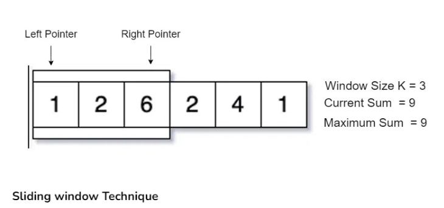
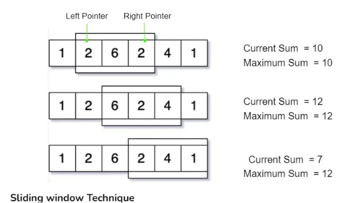

# Sliding Window Technique

Sliding window problems are problems in which a fixed or variable-size window is moved through a data structure, typically an array or string to  solve problems efficiently based on continuous subsets of elements. 


This techniue is used we need to find subarrays or substrings according to a given set of conditions.

This Technique is commonly used in algorithms like finding subarrays with specific sum,
finding the longest substring with unique characters
solving problems that require a fixed -size window to process elements efficiently


Problem 1
    Lets take an example to understand this properly, say we have an array of size N and also an integer K. Now, we have to calculate the maximum sum of subarray having size exactly K

Approach:
    Now How should we approach this one?
    1. One way to do this by taking each subarray of size K from the array and find out the maximum sum of these subarrays. this can be done using Nested loops which will result into O(N^2) Time Complexity.
    2. We can take one K size subarray from 0 to K-1 index and calculate its sum now shift our range one by one along with the iterations and update the result, like in next iteration increase the left and right pointer and update the previous sum as shown in the below image:


    

    Now Follow this iteration till we reach the end of the array.


    

    So We can see that instead of recalculating the sum of each K sized subarray we are using previuos window of size K and using itsresults we update the sum and shift the window right by moving left and right pointers, this operation is optimal because it takes O(1) time to shift the range instead of recalculating.

    This approach of shifting the pointers and calculating the results accordingly is known as Sliding window Technique.


## How to use Sliding Window Techniue?

There are basically two types of sliding window:

### 1. Fixed size sliding window

    The general steps to solve these questions by following below steps:
    1. Find the size of the window required, say k.
    2. Compute the result for 1st window, i.e include the first K elements of the data structure.
    3. Then use a loop to slide the window by 1 and keep computing the result window by window.

### 2. Variable size Sliding Window

The general steps to solve these questions below steps:
    1. In this type of sliding window problems, we increase our right pointer one by one till our condition is true.
    2.  At any step if our condition does not match, weshrink the size of our window by increasing left pointer.
    3. Again, when our condition satisfies, we start increasing the right pointer and follow step 1
    4.  We follow these steps until we reach to the end of the array

### How to Identify Sliding Window Problems:

    These Problems generally require Finding Maximum/minimum Subarray, Substrings which satisfy some specific condition.

    The size of the subarray or substring 'K' will be given in some of the problems.

    These problems can easily be solved in O(N^2) time complexity using nested loops, using sliding window we can solve these in O(N) time complexity.

    Required Time Complexity: O(N) or O(NlogN)

    Constraints: N <= 10^6. If N is the size of the Array/string.

Example Code

```python
# O(n) solution for finding
# maximum sum of a subarray of size k


def maxSum(arr, k):
    # length of the array
    n = len(arr)

    # n must be greater than k
    if n <= k:
        print("Invalid")
        return -1

    # Compute sum of first window of size k
    window_sum = sum(arr[:k])

    # first sum available
    max_sum = window_sum

    # Compute the sums of remaining windows by
    # removing first element of previous
    # window and adding last element of
    # the current window.
    for i in range(n - k):
        window_sum = window_sum - arr[i] + arr[i + k]
        max_sum = max(window_sum, max_sum)

    return max_sum


# Driver code
arr = [1, 4, 2, 10, 2, 3, 1, 0, 20]
k = 4
print(maxSum(arr, k))

# This code is contributed by Kyle McClay


```
